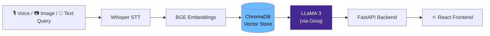
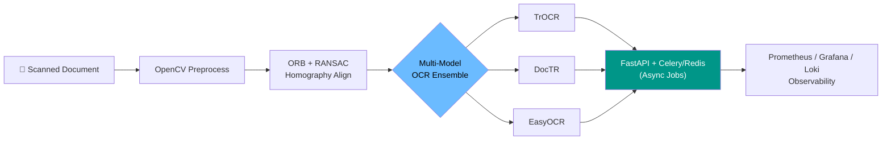
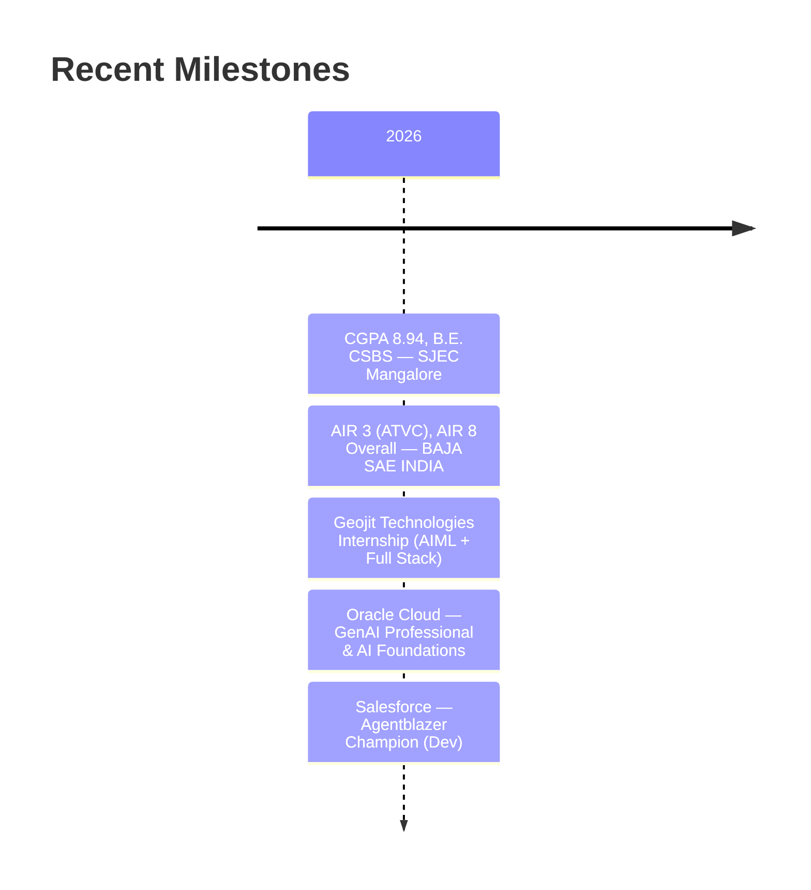

<div align="center">


<a href="https://git.io/typing-svg">
  
</a>

<br/>

[](https://linkedin.com/in/sohan1919)
[](mailto:sohandsouza15@gmail.com)
[](https://github.com/Sohan-dsz)
[](https://sohan19.netlify.app)


</div>

---

## 👋 About Me

```yaml
name: Sohan D'Souza
education: "B.E. Computer Science & Business Systems, SJEC Mangalore (VTU) — CGPA 8.94"
batch: "2026 (Fresher)"
location: "Shivamogga, Karnataka, India — open to relocation"
focus: ["AI/ML Engineering", "Computer Vision", "Full-Stack Development"]
currently: "Actively interviewing for AI/ML Engineer, SWE, and Full-Stack roles"
fun_fact: "Captained a 30-member team to AIR 3 nationally at BAJA SAE INDIA 2026"
```

---

## 🧠 How I Build AI Systems

A look at the kind of pipelines I actually ship — not just diagrams, these map to real projects below.

**HealthMate — Multimodal RAG Pipeline**



**Document Analysis Studio — Production OCR Pipeline**



---

## 🚀 Featured Projects

<table>
<tr>
<td width="50%" valign="top">

### 🎙️ HealthMate
Multimodal RAG-based AI health assistant. Voice and image input via **Whisper**, retrieval over **ChromaDB** with **BGE embeddings**, generation via **LLaMA 3 on Groq**, orchestrated with **LangChain**. Shipped with Docker + GitHub Actions CI/CD.

`LangChain` `ChromaDB` `Groq` `Whisper` `FastAPI` `Docker`

</td>
<td width="50%" valign="top">

### 🧾 Document Analysis Studio
Production-grade OCR system from my Geojit Technologies internship. **OpenCV** + **ORB/RANSAC** alignment feeding a **multi-model ensemble (TrOCR, DocTR, EasyOCR)**, served async via **Celery/Redis**, monitored with **Prometheus/Grafana/Loki**.

`OpenCV` `TrOCR` `DocTR` `EasyOCR` `Celery` `Grafana`

</td>
</tr>
<tr>
<td width="50%" valign="top">

### ☁️ NAAC Data Management Platform
Cloud-native accreditation data platform — **Django/React/PostgreSQL/Docker**, 🥇 1st prize at college project exhibition. Also rebuilt as an enterprise-grade **Java microservices** version with Spring Boot, Kafka, and Spring Cloud.

`Django` `React` `PostgreSQL` `Spring Boot` `Kafka`

</td>
<td width="50%" valign="top">

### 💬 EmoBhaava
Multilingual sentiment classifier built on **XLM-RoBERTa**, shipped with CI/CD and **Prometheus** metrics for live monitoring of model performance.

`XLM-RoBERTa` `Transformers` `Prometheus` `CI/CD`

</td>
</tr>
</table>

---

## 🛠️ Tech Stack

<div align="center">

**AI / ML**


**Backend & DevOps**


**Frontend**


</div>

---

## 📊 GitHub Stats

<div align="center">
  
  
</div>

<div align="center">
  
</div>

<div align="center">
  
</div>

---

## 🏆 Achievements & Certifications



- 🥇 **AIR 3 (ATVC) & AIR 8 Overall** — BAJA SAE INDIA 2026, captaining a 30-member cross-functional team
- 🎓 **CGPA 8.94** — B.E. Computer Science & Business Systems, SJEC Mangalore
- 🏅 **Oracle Certified** — Cloud Infrastructure Generative AI Professional
- 🏅 **Oracle Certified** — AI Foundations Associate
- 🏅 **Salesforce Certified** — Agentforce, Apex, Flow · Agentblazer Champion (Dev)
- 🔬 **Production OCR System** — multi-model ensemble pipeline built during Geojit Technologies internship

---

## 🤝 Let's Connect

<div align="center">

I'm actively interviewing for **AI/ML Engineer**, **Software Engineer**, and **Full-Stack Developer** roles.
If you're working on something interesting — let's talk!

[](mailto:sohandsouza15@gmail.com)
[](https://linkedin.com/in/sohan1919)
[](https://sohan19.netlify.app)

</div>

---

<div align="center">


*"Build systems that think. Ship products that matter."*

</div>
